# June - Personal AI Agent

## Inspiration

The inspiration for June came from a desire to create a **truly open and accessible voice AI system** that doesn't rely on expensive proprietary APIs or cloud services. We wanted to build something that puts privacy first while delivering the convenience of modern AI assistants.

Key motivating factors included:

- **Open Source Philosophy**: Moving away from closed-source AI models like Claude and embracing the transparency of GPT-OSS
- **Cost Efficiency**: Eliminating recurring API costs through self-hosted and optimized cloud solutions  
- **Privacy First**: Ensuring user data stays within controlled environments
- **Educational Value**: Understanding the complete voice AI pipeline from speech-to-text to intelligent responses
- **Real-world Integration**: Creating a practical system that can handle daily tasks like email management, calendar scheduling, and phone calls

> *"The future of AI should be open, accessible, and in the hands of developers who can shape it responsibly."*

- **✅ Successfully migrated from proprietary Claude AI to open-source GPT-OSS 20B**
- **✅ Achieved sub-second response times for voice interactions**
- **✅ Built a complete microservices architecture with 5 specialized servers**
- **✅ Integrated multiple Google services with secure OAuth2 authentication**
- **✅ Created a seamless voice processing pipeline from speech to response**
- **✅ Developed robust error handling and fallback mechanisms**
- **✅ Built a functional Android app for real-time voice interaction**
- **✅ Implemented intent classification with high accuracy**
- **✅ Achieved cost-effective AI processing through smart cloud API usage**

## What we learned

**June** is an advanced, open-source voice assistant that leverages the power of GPT-OSS 20B models through Groq's lightning-fast API infrastructure. The system provides:

- **Real-time Voice Processing**: Converts speech to text using OpenAI Whisper, processes with GPT-OSS 20B, and responds with natural speech
- **Google Services Integration**: Seamless access to Gmail, Google Calendar, and Contacts with OAuth2 authentication
- **Intent Recognition**: Intelligent classification of user requests (email queries, calendar management, phone calls)
- **Microservices Architecture**: Scalable, distributed system with specialized servers for different AI tasks
- **Sub-second Response Times**: Optimized pipeline delivering voice responses in under 1 second
- **Privacy-Focused**: All processing can be done locally or through trusted open-source APIs

## How we built it

We built June using a **microservices architecture** with specialized servers handling different aspects of the voice AI pipeline:

### Architecture Design

```mermaid
graph TB
    subgraph "Client Layer"
        A[📱 Android App<br/>Voice Input/Output]
    end
    
    subgraph "Orchestration Layer"
        B[🎯 Main Server<br/>Port 5005<br/>Request Routing & Pipeline Control]
    end
    
    subgraph "AI Processing Layer"
        C[🎤 Whisper Server<br/>Port 5004<br/>Speech-to-Text]
        D[🧠 GPT-OSS Server<br/>Port 5003<br/>AI Processing]
        E[🔊 TTS Server<br/>Port 5002<br/>Text-to-Speech]
    end
    
    subgraph "Integration Layer"
        F[🔗 MCP Server<br/>Port 8080<br/>Google Services]
    end
    
    subgraph "External Services"
        G[🤖 OpenAI Whisper<br/>Local Model]
        H[⚡ Groq API<br/>GPT-OSS 20B Cloud]
        I[🎵 TTS Engine<br/>Voice Synthesis]
    end
    
    subgraph "Google Workspace"
        J[📧 Gmail API]
        K[📅 Calendar API]
        L[👤 Contacts API]
        M[📺 YouTube API]
    end
    
    %% User Flow
    A -->|Voice Command| B
    B -->|Audio Data| C
    B -->|Text Query| D
    B -->|Response Text| E
    B -->|Service Requests| F
    
    %% Processing Flow
    C -->|Transcription| G
    D -->|AI Inference| H
    E -->|Audio Generation| I
    F -->|API Calls| J
    F --> K
    F --> L
    F --> M
    
    %% Response Flow
    G -->|Text Result| B
    H -->|AI Response| B
    I -->|Audio File| B
    J -->|Email Data| B
    K -->|Calendar Data| B
    L -->|Contact Data| B
    M -->|Video Data| B
    
    B -->|Final Response| A
    
    %% Styling
    classDef clientStyle fill:#e1f5fe,stroke:#01579b,stroke-width:2px
    classDef serverStyle fill:#f3e5f5,stroke:#4a148c,stroke-width:2px
    classDef aiStyle fill:#e8f5e8,stroke:#1b5e20,stroke-width:2px
    classDef externalStyle fill:#fff3e0,stroke:#e65100,stroke-width:2px
    classDef googleStyle fill:#e3f2fd,stroke:#0d47a1,stroke-width:2px
    
    class A clientStyle
    class B serverStyle
    class C,D,E,F aiStyle
    class G,H,I externalStyle
    class J,K,L,M googleStyle
```

### Technical Stack

- **FastAPI**: High-performance async web framework for all microservices
- **Python 3.11+**: Core programming language with async/await support
- **GPT-OSS 20B**: Large language model accessed via Groq's optimized API
- **OpenAI Whisper**: Speech-to-text conversion with high accuracy
- **Custom TTS Engine**: Text-to-speech synthesis for natural responses
- **Google OAuth2**: Secure authentication for Google services integration

### Development Process

1. **Foundation Setup**: Created virtual environment and installed dependencies
2. **Model Migration**: Replaced Claude AI with GPT-OSS 20B via Groq API for cost efficiency and transparency
3. **Microservices Design**: Built 5 specialized servers with specific port allocations (5002-5005, 8080)
4. **Voice Pipeline**: Integrated Whisper → GPT-OSS → TTS for seamless voice interactions
5. **Google Integration**: Implemented OAuth2 flow for Gmail, Calendar, and Contacts APIs
6. **Mobile App**: Built Android client for voice input and real-time communication

## Challenges we ran into

### 1. **Model Size and Compute Limitations**
Initially attempted to run GPT-OSS 20B locally, but the 40-80GB model size exceeded our hardware capabilities. **Solution**: Migrated to Groq API for cloud-hosted inference, maintaining open-source principles while gaining speed.

### 2. **Real-time Performance Requirements**
Voice interactions demand sub-second response times, but our initial pipeline was too slow. **Solution**: Optimized with async processing and mathematical modeling:

$$T_{total} = T_{transcription} + T_{processing} + T_{synthesis} + T_{network} < 1000ms$$

### 3. **Port Conflicts and Server Management**
Multiple Python servers competing for the same ports caused startup failures. **Solution**: Implemented systematic port allocation (TTS:5002, GPT-OSS:5003, Whisper:5004, Main:5005, MCP:8080) and process management.

### 4. **Google API Authentication Complexity**
OAuth2 flow for multiple Google services proved challenging with token refresh and service management. **Solution**: Built centralized authentication manager with automatic token refresh and error handling.

### 5. **Intent Classification Accuracy**
Determining user intent from natural speech was inconsistent. **Solution**: Developed hybrid approach combining rule-based patterns with AI-powered classification for better accuracy.

### 6. **System Reliability and Fallbacks**
External API failures could break the entire pipeline. **Solution**: Implemented multi-layer fallback system with graceful degradation and error recovery.

## Accomplishments that we're proud of

### Technical Skills
- **Microservices Architecture**: Learned to design scalable, maintainable distributed systems with proper service separation
- **API Integration**: Mastered working with multiple external APIs and complex authentication flows
- **Real-time Processing**: Gained expertise in optimizing for low-latency voice interactions and async programming
- **Cloud API Usage**: Discovered how to leverage optimized inference APIs like Groq for cost-effective AI processing

### AI/ML Insights
- **Model Selection**: Understood trade-offs between local deployment and cloud APIs for large language models
- **Voice Processing Pipeline**: Gained end-to-end understanding of speech-to-text, AI processing, and text-to-speech systems
- **Intent Recognition**: Learned to build hybrid classification systems combining rule-based and AI approaches
- **Prompt Engineering**: Developed skills in crafting effective prompts for different AI use cases

### Development Practices
- **Error Handling**: Learned to build robust systems with multiple fallback layers and graceful degradation
- **Performance Optimization**: Mastered measuring and improving system response times using mathematical modeling
- **Testing Strategies**: Developed approaches for testing complex distributed systems with multiple dependencies
- **Documentation**: Gained experience creating comprehensive technical documentation for complex projects

### Problem-Solving Approaches
- **Systematic Debugging**: Developed methodical approaches to identifying and resolving complex integration issues
- **Resource Management**: Learned to work within hardware constraints and find creative cloud-based solutions
- **User Experience Design**: Understood the importance of sub-second response times for voice interactions
- **Open Source Philosophy**: Appreciated the benefits of transparent, community-driven AI development

## What's next for June - Personal AI Agent

### Immediate Roadmap
- **Multi-language Support**: Expanding beyond English to support global users
- **Custom Wake Words**: Implementing personalized activation phrases for better user experience
- **Local Model Deployment**: Self-hosted GPT-OSS for complete privacy and data control
- **Conversation Memory**: Context-aware multi-turn conversations that remember user preferences

### Advanced Features
- **Voice Cloning**: Personalized TTS voices using user's own voice samples
- **Advanced Integrations**: Adding Slack, Notion, GitHub, and other productivity APIs
- **Smart Home Control**: Integration with IoT devices and home automation systems
- **Meeting Assistant**: Real-time meeting transcription, summarization, and action item extraction

### Technical Improvements
- **Kubernetes Deployment**: Container orchestration for production scalability
- **Edge Computing**: Deploying lightweight models on mobile devices for offline capability
- **Enhanced Security**: End-to-end encryption and advanced authentication mechanisms
- **Performance Analytics**: Real-time monitoring and optimization of response times

### Long-term Vision
- **Open Source Community**: Building a community around June for collaborative development
- **Plugin Ecosystem**: Allowing third-party developers to extend June's capabilities
- **Enterprise Solutions**: Scaling June for business use cases with team collaboration features
- **Research Platform**: Using June as a testbed for new voice AI techniques and models

---

*Built with ❤️ using GPT-OSS, Groq API, and open-source technologies*

**Repository**: [June Voice AI](https://github.com/killjay/June)  
**License**: MIT
