# June - Personal AI Agent 🤖🗣️

[](https://opensource.org/licenses/MIT)
[](https://www.python.org/downloads/)
[](https://fastapi.tiangolo.com/)
[](https://github.com/openai/gpt-oss)

> **The Future of Voice AI is Open Source**

June is an advanced, open-source voice assistant that leverages the power of **GPT-OSS 20B** models through Groq's lightning-fast API infrastructure. Built with a vision for the next generation of smart devices - particularly smart glasses - June represents a complete migration from proprietary AI services to open-source alternatives.

## � Why June?

*"I believe phones have reached their peak in innovation, and the next big shift is smart glasses. They won't replace phones, but they will transform into the most powerful accessory we carry. Their true potential is to serve as a seamless personal assistant."*

June is built for this future - a voice-first AI that can seamlessly integrate into any device, providing intelligent assistance without compromise on privacy or performance.

## ✨ What June Does

- **🎤 Real-time Voice Processing**: Converts speech to text using OpenAI Whisper, processes with GPT-OSS 20B, and responds with natural speech
- **📧 Google Services Integration**: Seamless access to Gmail, Google Calendar, and Contacts with OAuth2 authentication
- **🧠 Intent Recognition**: Intelligent classification of user requests (email queries, calendar management, phone calls)
- **🏗️ Microservices Architecture**: Scalable, distributed system with specialized servers for different AI tasks
- **⚡ Sub-second Response Times**: Optimized pipeline delivering voice responses in under 1 second
- **🔒 Privacy-Focused**: All processing can be done locally or through trusted open-source APIs

## 🏗️ Architecture

June follows a **microservices architecture** with specialized servers handling different aspects of the voice AI pipeline:

```mermaid
graph TB
    subgraph "Client Layer"
        A[📱 Android App<br/>Voice Input/Output]
    end
    
    subgraph "Orchestration Layer"
        B[🎯 Main Server<br/>Port 5005<br/>Request Routing & Pipeline Control]
    end
    
    subgraph "AI Processing Layer"
        C[🎤 Whisper Server<br/>Port 5004<br/>Speech-to-Text]
        D[🧠 GPT-OSS Server<br/>Port 5003<br/>AI Processing]
        E[🔊 TTS Server<br/>Port 5002<br/>Text-to-Speech]
    end
    
    subgraph "Integration Layer"
        F[🔗 MCP Server<br/>Port 8080<br/>Google Services]
    end
    
    subgraph "External Services"
        G[🤖 OpenAI Whisper<br/>Local Model]
        H[⚡ Groq API<br/>GPT-OSS 20B Cloud]
        I[🎵 TTS Engine<br/>Voice Synthesis]
    end
    
    subgraph "Google Workspace"
        J[📧 Gmail API]
        K[📅 Calendar API]
        L[👤 Contacts API]
        M[📺 YouTube API]
    end
    
    %% User Flow
    A -->|Voice Command| B
    B -->|Audio Data| C
    B -->|Text Query| D
    B -->|Response Text| E
    B -->|Service Requests| F
    
    %% Processing Flow
    C -->|Transcription| G
    D -->|AI Inference| H
    E -->|Audio Generation| I
    F -->|API Calls| J
    F --> K
    F --> L
    F --> M
    
    %% Response Flow
    G -->|Text Result| B
    H -->|AI Response| B
    I -->|Audio File| B
    J -->|Email Data| B
    K -->|Calendar Data| B
    L -->|Contact Data| B
    M -->|Video Data| B
    
    B -->|Final Response| A
```



## 🚀 Quick Start

### Prerequisites

- **Python 3.11+**
- **Android Studio** (for mobile app)
- **Groq API Key** (for GPT-OSS access)
- **Google Cloud Console** (for Google APIs)

### Installation

1. **Clone the repository**
   ```bash
   git clone https://github.com/killjay/Personal-AI-Agent.git
   cd Personal-AI-Agent
   ```

2. **Set up Python environment**
   ```bash
   python -m venv .venv
   # Windows
   .venv\Scripts\activate
   # Linux/Mac
   source .venv/bin/activate
   ```

3. **Install dependencies**
   ```bash
   pip install -r requirements.txt
   pip install -r whisper_requirements.txt
   pip install -r tts_requirements.txt
   ```

4. **Configure API keys**
   ```bash
   # Create environment file
   cp .env.example .env
   
   # Edit .env with your API keys:
   GROQ_API_KEY=your_groq_api_key_here
   GOOGLE_APPLICATION_CREDENTIALS=path/to/google/credentials.json
   ```

5. **Start the servers**
   ```bash
   # Terminal 1: TTS Server
   python tts_server.py
   
   # Terminal 2: GPT-OSS Server  
   python gptoss_server.py
   
   # Terminal 3: Whisper Server
   python whisper_server.py
   
   # Terminal 4: MCP Server
   python server/mcp_server.py
   
   # Terminal 5: Main Server
   python server/server.py
   ```

6. **Test the system**
   ```bash
   # Health check all services
   python test_mcp_status.py
   
   # Test voice pipeline
   python test_voice_response.py
   ```

## 🛠️ Built With

### **Languages & Frameworks**
- **Python 3.11+** - Core backend language with async/await support
- **FastAPI** - High-performance async web framework for all microservices
- **Android SDK** - Mobile app development
- **Uvicorn** - ASGI server for production deployment

### **AI & Machine Learning**
- **GPT-OSS 20B** - Large language model via Groq's optimized API
- **OpenAI Whisper** - Speech-to-text conversion with high accuracy
- **Custom TTS Engine** - Text-to-speech synthesis for natural responses
- **Transformers** - ML model handling and processing

### **Cloud Services & APIs**
- **Groq API** - Lightning-fast GPT-OSS 20B inference
- **Gmail API** - Email management and querying
- **Google Calendar API** - Schedule management and appointments
- **Google Contacts API** - Contact lookup and management
- **YouTube API** - Video content integration
- **Google OAuth2** - Secure authentication service

### **Integration & Communication**
- **MCP (Model Context Protocol)** - Service orchestration
- **REST APIs** - Inter-service communication
- **CORS Middleware** - Cross-origin resource sharing
- **JSON** - Data interchange format

## 🎯 Key Features

### **Voice Processing Pipeline**
```
🎤 Speech Input → 🤖 Whisper STT → 🧠 GPT-OSS Processing → 🔊 TTS Output → 📱 Audio Response
```

### **Performance Optimization**
- **Mathematical Response Time Model**:
  ```
  T_total = T_transcription + T_processing + T_synthesis + T_network < 1000ms
  ```
- **Async Processing**: All servers use FastAPI's async capabilities
- **Connection Pooling**: Efficient API connection management
- **Fallback Systems**: Multi-layer error handling and graceful degradation

### **Google Services Integration**
- **📧 Email Management**: Read, search, and summarize emails
- **📅 Calendar Operations**: Schedule management and meeting coordination
- **👤 Contact Lookup**: Quick access to contact information
- **🔐 Secure Authentication**: OAuth2 flow with automatic token refresh

## 📱 Mobile App

The Android companion app provides:
- **Voice Input**: High-quality audio recording
- **Real-time Communication**: Direct connection to June's servers
- **Response Playback**: Natural voice output
- **Status Monitoring**: Server health and connection status

### APK Installation
```bash
cd android-app
./gradlew assembleDebug
# Install: app/build/outputs/apk/debug/app-debug.apk
```

## 🧪 Testing

### **Run All Tests**
```bash
# Test individual components
python test_tts_simple.py        # TTS functionality
python test_email_query.py       # Email integration
python test_complete_workflow.py # End-to-end pipeline

# Test server health
python test_mcp_status.py        # All server status
```

### **Voice Testing**
```bash
# Test voice response pipeline
python test_voice_response.py

# Test TTS diagnostics
python test_tts_diagnostics.py
```

## 📁 Project Structure

```
June/
├── 📱 android-app/              # Android mobile application
├── 🖥️ server/                   # Core server implementations
│   ├── server.py               # Main orchestration server
│   ├── mcp_server.py           # Google services integration
│   ├── calendar_api_server.py  # Calendar operations
│   └── gmail_api_server.py     # Email operations
├── 🤖 AI Servers/
│   ├── gptoss_server.py        # GPT-OSS processing server
│   ├── whisper_server.py       # Speech-to-text server
│   └── tts_server.py           # Text-to-speech server
├── 🧪 Testing/
│   ├── test_*.py               # Comprehensive test suite
│   └── requirements.txt        # Test dependencies
├── 📚 Documentation/
│   ├── README.md               # This file
│   ├── PROJECT_STORY.md        # Detailed project journey
│   ├── ARCHITECTURE.md         # Technical architecture
│   └── TESTING_GUIDE.md        # Testing instructions
└── 🔧 Configuration/
    ├── .env.example            # Environment template
    ├── requirements.txt        # Python dependencies
    └── setup_*.sh/.bat         # Setup scripts
```

## 🚧 Challenges Overcome

### **1. Model Size & Compute Limitations**
- **Challenge**: GPT-OSS 20B models (40-80GB) exceeded local hardware
- **Solution**: Migrated to Groq API for cloud-hosted inference

### **2. Real-time Performance Requirements** 
- **Challenge**: Voice interactions demand sub-second response times
- **Solution**: Async processing and mathematical optimization modeling

### **3. Microservices Coordination**
- **Challenge**: Multiple Python servers with port conflicts
- **Solution**: Systematic port allocation (5002-5005, 8080) and process management

### **4. Google API Authentication Complexity**
- **Challenge**: OAuth2 flow for multiple services with token management
- **Solution**: Centralized authentication manager with automatic refresh

### **5. Intent Classification Accuracy**
- **Challenge**: Determining user intent from natural speech
- **Solution**: Hybrid approach combining rule-based patterns with AI classification

## 🏆 Accomplishments

- ✅ **Successfully migrated from proprietary Claude AI to open-source GPT-OSS 20B**
- ✅ **Achieved sub-second response times for voice interactions**
- ✅ **Built complete microservices architecture with 5 specialized servers**
- ✅ **Integrated multiple Google services with secure OAuth2 authentication**
- ✅ **Created seamless voice processing pipeline from speech to response**
- ✅ **Developed robust error handling and fallback mechanisms**
- ✅ **Built functional Android app for real-time voice interaction**
- ✅ **Implemented intent classification with high accuracy**
- ✅ **Achieved cost-effective AI processing through smart cloud API usage**

## 🔮 What's Next

### **Immediate Roadmap**
- **🌍 Multi-language Support**: Expanding beyond English for global users
- **🎯 Custom Wake Words**: Personalized activation phrases
- **🏠 Local Model Deployment**: Self-hosted GPT-OSS for complete privacy
- **🧠 Conversation Memory**: Context-aware multi-turn conversations

### **Advanced Features**
- **🎵 Voice Cloning**: Personalized TTS voices using user samples
- **🔗 Advanced Integrations**: Slack, Notion, GitHub, and productivity APIs
- **🏡 Smart Home Control**: IoT devices and home automation
- **📝 Meeting Assistant**: Real-time transcription and summarization

### **Technical Improvements**
- **☸️ Kubernetes Deployment**: Container orchestration for production
- **📱 Edge Computing**: Lightweight models on mobile devices
- **🔒 Enhanced Security**: End-to-end encryption and advanced auth
- **📊 Performance Analytics**: Real-time monitoring and optimization

## 📖 Documentation

- **[Project Story](PROJECT_STORY.md)**: Detailed development journey and lessons learned
- **[Architecture Guide](ARCHITECTURE.md)**: Technical deep-dive into system design  
- **[Testing Guide](TESTING_GUIDE.md)**: Comprehensive testing instructions
- **[Calendar Integration](CALENDAR_INTEGRATION_GUIDE.md)**: Google Calendar setup
- **[Meeting Scheduling](MEETING_SCHEDULING.md)**: Advanced scheduling features

## 🤝 Contributing

We welcome contributions! Please see our [Contributing Guidelines](CONTRIBUTING.md) for details.

1. Fork the repository
2. Create your feature branch (`git checkout -b feature/AmazingFeature`)
3. Commit your changes (`git commit -m 'Add some AmazingFeature'`)
4. Push to the branch (`git push origin feature/AmazingFeature`)
5. Open a Pull Request

## 📄 License

This project is licensed under the MIT License - see the [LICENSE](LICENSE) file for details.

## 🙏 Acknowledgments

- **OpenAI** for the Whisper speech recognition model
- **Groq** for providing lightning-fast GPT-OSS inference
- **Google** for comprehensive API ecosystem
- **FastAPI** team for the excellent web framework
- **The open-source community** for making this possible

## 📞 Contact

**Nandha Kumar** - [@killjay](https://github.com/killjay) - inandha97@gmail.com

**Project Link**: [https://github.com/killjay/Personal-AI-Agent](https://github.com/killjay/Personal-AI-Agent)

---

*Built with ❤️ using GPT-OSS, Groq API, and open-source technologies*

**⭐ Star this repo if you found it helpful!**
"Dial 911"                     → Opens dialer with 911
```

## 🔧 Configuration

### Server Configuration
- **Port**: Default 5005 (configurable in `server.py`)
- **Host**: Binds to all interfaces (0.0.0.0)
- **Model**: Whisper "small" (244M parameters)

### Android Configuration
- **Server IP**: Update `SERVER_IP` in `MainActivity.kt`
- **Audio Format**: AAC encoding for compatibility
- **Permissions**: Microphone, Phone, Contacts, SMS

## 🛠️ Development

### Project Structure
```
June/
├── server/
│   ├── server.py           # FastAPI server with Whisper
│   ├── requirements.txt    # Python dependencies
│   └── .venv/             # Virtual environment
├── android-app/
│   ├── app/src/main/java/com/voiceaiagent/
│   │   └── MainActivity.kt # Main Android app logic
│   ├── build.gradle       # Android build config
│   └── app/build.gradle   # App-specific config
└── README.md
```

### Key Components

#### Server (`server.py`)
- **Whisper Integration**: Speech-to-text with English language forcing
- **GPT-OSS Model**: Natural language processing for intent recognition (open-source, Hugging Face)
- **FastAPI**: REST API endpoint for audio processing
- **FFmpeg**: Audio format handling and conversion

#### Android App (`MainActivity.kt`)
- **Audio Recording**: MediaRecorder with AAC format
- **Universal App Detection**: Scans all installed apps
- **Contact Integration**: Phone and SMS contact lookup
- **Network Communication**: OkHttp for server requests

## 🎯 Voice Command Processing

1. **Audio Capture**: Android MediaRecorder → WAV/AAC file
2. **Network Transfer**: HTTP POST to Python server
3. **Speech Recognition**: Whisper transcription (English)
4. **NLP Processing**: GPT-OSS intent parsing (Hugging Face model)
5. **Action Execution**: Android Intent system

### Response Format
```json
{
  "action": "open_app",
  "app": "gmail"
}

{
  "action": "call", 
  "contact": "John Smith"
}

{
  "action": "send_sms",
  "contact": "Mom",
  "message": "Hello"
}
```

## 🔒 Security & Privacy

- **Local Processing**: Speech recognition happens on local network
- **No Cloud Storage**: Audio files are temporary and deleted
- **Model Security**: Download and store GPT-OSS model securely
#
# GPT-OSS models are free to download on Hugging Face.
# Learn more about the models: https://openai.com/open-models
# Github: https://github.com/openai/gpt-oss
- **Network Security**: Use on trusted WiFi networks only

## 🐛 Troubleshooting

### Common Issues

**"App not found" errors**:
- Check app installation and spelling
- Review Android logs for detailed app search results
- Verify app has launcher intent

**Audio transcription failures**:
- Ensure FFmpeg is in system PATH
- Check microphone permissions
- Verify network connectivity

**Server connection issues**:
- Confirm IP address configuration
- Check firewall settings
- Verify both devices on same network

### Debug Logging
- **Server**: Check console for Whisper transcription results
- **Android**: Use `adb logcat | grep VoiceAgent` for detailed logs

## 🚧 Future Enhancements

- **Wake Word Detection**: "Hey June" activation
- **Conversation Context**: Multi-turn conversations
- **Smart Home Integration**: IoT device control
- **Offline Mode**: Local speech recognition
- **Multiple Languages**: Beyond English support

## 📄 License

MIT License - see LICENSE file for details

## 🤝 Contributing

1. Fork the repository
2. Create feature branch (`git checkout -b feature/amazing-feature`)
3. Commit changes (`git commit -m 'Add amazing feature'`)
4. Push to branch (`git push origin feature/amazing-feature`)
5. Open Pull Request

## 📞 Support

For issues and questions:
- Open GitHub issue
- Check troubleshooting section
- Review server logs for errors

---

**Built with ❤️ for voice automation enthusiasts**
